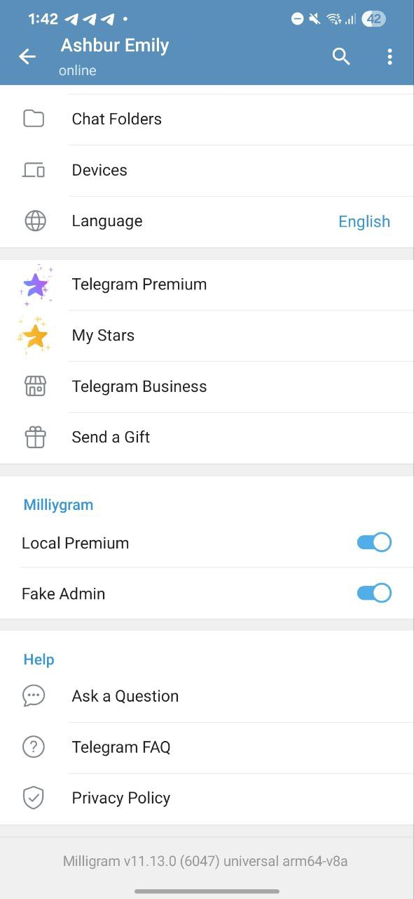

## Milliygram based on Radolyn && Telegram

## Screenshots && Some features added based on @bytegroup_co

  

### Localization

We moved all translations to https://translations.telegram.org/en/android/. Please use it.

## Profile Author

**Farid Fatehi**  
Telegram: [@bytegroup_co](https://t.me/bytegroup_co)
